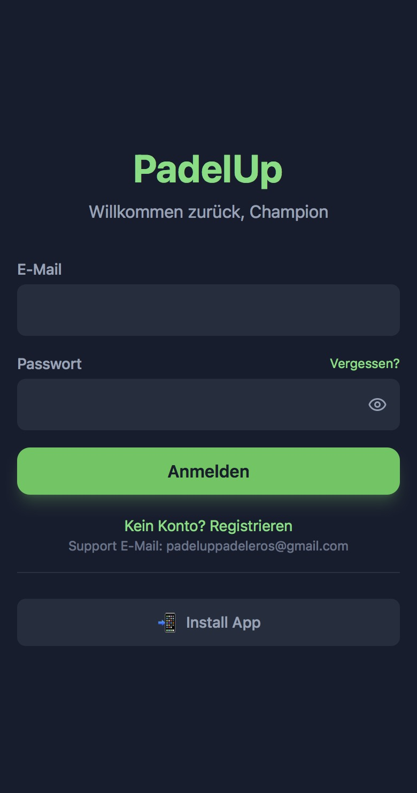
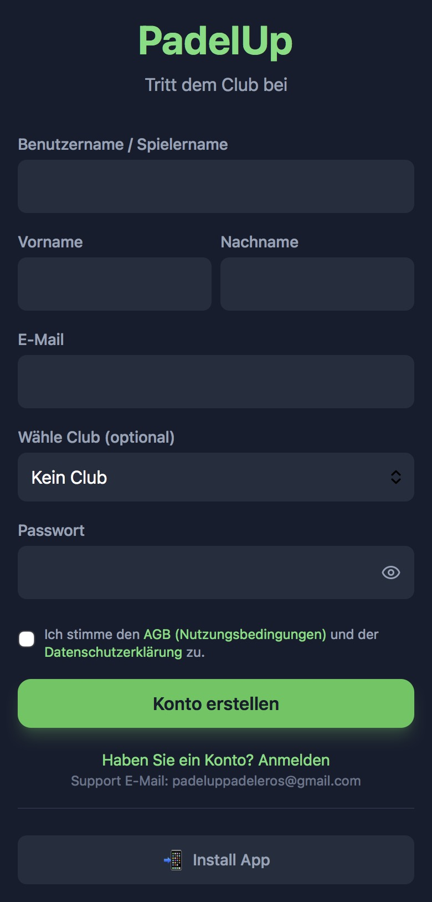
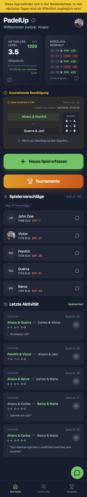
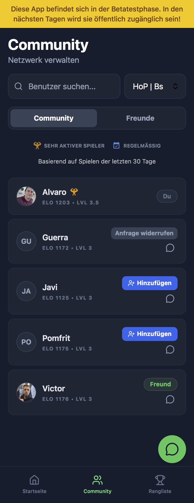
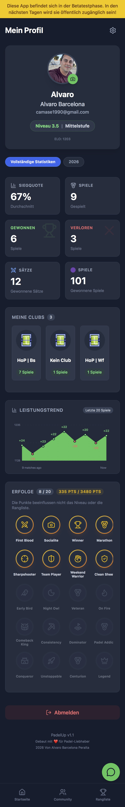
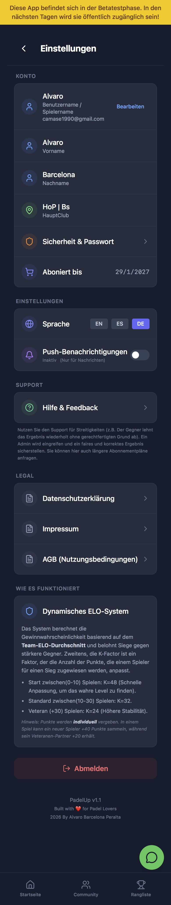

# PadelUp - Social Padel Tracker

## Important for recruiters:
I am fully aware of the workflow involved in working with versions and branches, and I understand that working on the master branch is NOT the correct or logical approach in real projects. However, this is a private project, and if it were to grow, I would work with branches and push requests to the master branch as usual.

**PadelUp** is a modern, mobile-first web application designed for amateur padel groups to track matches, maintain competitive ELO rankings, and foster community through social features and gamification.

## 📸 Screenshots

|                     Login                     |                    Sign Up                     |                     Home                     |                     Ranks                     |
| :-------------------------------------------: | :--------------------------------------------: | :------------------------------------------: | :-------------------------------------------: |
|  |  |  |  |

|                     Community                     |                      Profile                      |                     Settings                     |     |
| :-----------------------------------------------: | :-----------------------------------------------: | :----------------------------------------------: | :-: |
|  |  |  |     |

## 🚀 Features

### 🎾 Core Match Tracking

- **Smart Interface**: Select 4 players and enter set scores.
- **Auto-Winner Logic**: Automatically determines the winning team based on set scores.
- **ELO System**: Updates player ratings immediately after every match using a standard K-factor algorithm.

### 🏆 Gamification

- **Achievements**: Unlockable badges for milestones (e.g., "First Blood", "On Fire", "Comeback King").
- **Leaderboards**: Real-time ranking sorted by ELO with top-3 highlighting.
- **Activity Feed**: See recent matches and unlocked achievements.

### 🤝 Social & Community

- **Friendships**: Send and accept friend requests to build your network.
- **Internal Chat**: Direct messaging system between friends.
- **Notifications**: Alerts for new messages and friend requests.

### 🛠️ Administration

- **User Management**: Approve/Ban users and manage roles.
- **Match Oversight**: Review and override match results if necessary.
- **Reporting**: View system logs and user activity.

---

## 💻 Tech Stack

- **Frontend**: React 19, TypeScript, Vite
- **Styling**: Tailwind CSS v3, Lucide React Icons
- **Backend**: Supabase (PostgreSQL 17, Auth, Edge Functions)
- **Internationalization**: `i18next` (English/Spanish support)

---

## 🗄️ Database Schema

The application runs on a robust PostgreSQL schema featuring Row Level Security (RLS) for data protection.

### Key Tables

- **`profiles`**: User data, ELO ratings, and stats. Linked to Supabase Auth.
- **`matches`**: Stores teams, scores (`jsonb`), and match status (`pending`, `confirmed`).
- **`friendships`**: Manages connections between users (`pending`/`accepted`).
- **`achievements`**: Definitions of all unlockable badges.
- **`user_achievements`**: Records of badges earned by users.
- **`messages`**: Real-time chat messages.

### Key Functions

- `confirm_match()`: Atomically updates ELO ratings and match status.
- `process_expired_matches()`: Auto-confirms pending matches after 24h.

---
